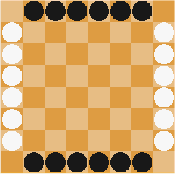
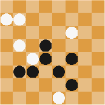

# Assignment2

Below are the rules for the game Lines of Action. For this part of the assignment you are to write a board evaluator, and a correct alpha-beta minimax search for the game. I have provided Java files to maintain the board state, to test the legality of a move, and to generate a list of possible moves as a Vector for one or all of the pieces in the class directory. You are responsible for completing the LOABoard.heuristicEvaluation(), and writing a MinimaxAlphaBetaSearch class. Do not feel constrained by my code, if you feel that you need additional elements or different functionality feel free to change it, but be sure to document the changes.

Notes:

- In the LOABoard class, set the BOARD_SIZE to be 4 or 5 for easier debugging (mnkGame, i.e. TicTacToe is also included).

- In the LOACustomPanel class, set the SELF_PLAY to true if you want to play against yourself to get a feel for the rules.

Lines of Action Rules:

The black pieces are placed in two rows along the top and bottom of the board, while the white pieces are placed in two files at the left and right side of the board (Figure 1).
The players alternately move, starting with Black.
A player to move must move one of its pieces. A move takes place in a straight line (up, down, left, right, and all four diagonals), exactly as many squares as there are pieces of either color anywhere along the line of movement (These are the Lines of Action).
A player may jump over its own pieces.
A player may not jump over the opponent’s pieces, but can capture them by landing on them.
To win a player must move all their pieces on the board into one connected unit. The first player to do so is the winner. The connections within the group may be either orthogonal or diagonal. For example, in Figure 2 Black has won because the black pieces form one connected unit.
A2image002.png

Figure 1: Starting board.

If one player’s pieces are reduced by captures to a single piece, the game is a win for this player.
If a move simultaneously creates a single connected unit for both players, the player that moved wins.
A2image003.png

Figure 2: Black wins.

Additional Resources:

There are several articles on Lines of Action in the course directory under the subdirectory Articles. Some other links on the game:

Lines of Action home page

[Lines of Action](http://boardspace.net/loa/)

[Chess Programming - LOA](https://www.chessprogramming.org/Lines_of_Action)

U of A GAMES Group Home Page (YL and MONA)
[U of A GAMES](http://webdocs.cs.ualberta.ca/~darse/LOA/)

Mark Winands (MIA)
[Mark Winands](https://dke.maastrichtuniversity.nl/m.winands/loa/)

Turn-Ins:

Turn in should include your 1) source code, 2) instructions for compilation, and 3) a write-up describing 3.a) your implementation, 3.b) heuristic details, and 3.c) experiences.

Stipulations:

You are responsible for having your search halt at the set threshold depth, pruning the correct amount of space, and returning correct end game actions. For the threshold depth, note that one step is one players move whether it is your move or your opponents, and not your programs and your opponents countermove.